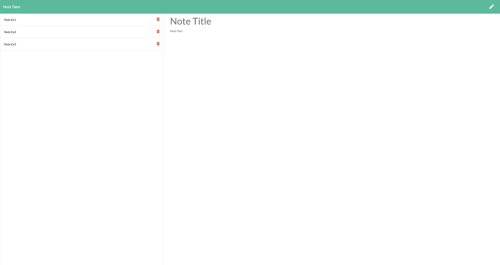

# Note Taker

> This web application allows the user to create a note.

### Table of Contents

- [Description](#description)
- [Installation](#installation)
- [Technologies](#technologies)
- [How To Use](#how-to-use)
- [Links](#links)
- [Author Info](#author-info)

---

## Description
This web application allows the user to create a note. Javascript, node.js, and express.js was used to accomplish this.

---

## Installation
none

---
[Back To The Top](#read-me-template)

## Technologies
Javascript, CSS, HTML, Node.js, Express.js, and jQuery.

[Back To The Top](#read-me-template)

---

## How To Use
  In this web application, the user will type a note in the text area, starting with the 'Note Title.' Next, user will click in the 'note text' to start typing
 the note. Save icon will appear in the nav bar on the top right. Click save and note will appear on the left side of the screen. Notes can be deleted using the red trash can icon.
   
[Back To The Top](#read-me-template)
   
---

## Links

Link to site:
https://morning-atoll-37083.herokuapp.com/

Link to GitHub repository:
https://github.com/deleonfrancis/note_Taker

[Back To The Top](#read-me-template)

---

## Author Info

- E-mail: dxfrancis.coding@gmail.com

[Back To The Top](#read-me-template)

---

## License

MIT
Copyright (c) 2021 Deleon Francis

Permission is hereby granted, free of charge, to any person obtaining a copy
of this software and associated documentation files (the "Software"), to deal
in the Software without restriction, including without limitation the rights
to use, copy, modify, merge, publish, distribute, sublicense, and/or sell
copies of the Software, and to permit persons to whom the Software is
furnished to do so, subject to the following conditions:

The above copyright notice and this permission notice shall be included in all
copies or substantial portions of the Software.

THE SOFTWARE IS PROVIDED "AS IS", WITHOUT WARRANTY OF ANY KIND, EXPRESS OR
IMPLIED, INCLUDING BUT NOT LIMITED TO THE WARRANTIES OF MERCHANTABILITY,
FITNESS FOR A PARTICULAR PURPOSE AND NONINFRINGEMENT. IN NO EVENT SHALL THE
AUTHORS OR COPYRIGHT HOLDERS BE LIABLE FOR ANY CLAIM, DAMAGES OR OTHER
LIABILITY, WHETHER IN AN ACTION OF CONTRACT, TORT OR OTHERWISE, ARISING FROM,
OUT OF OR IN CONNECTION WITH THE SOFTWARE OR THE USE OR OTHER DEALINGS IN THE
SOFTWARE.
